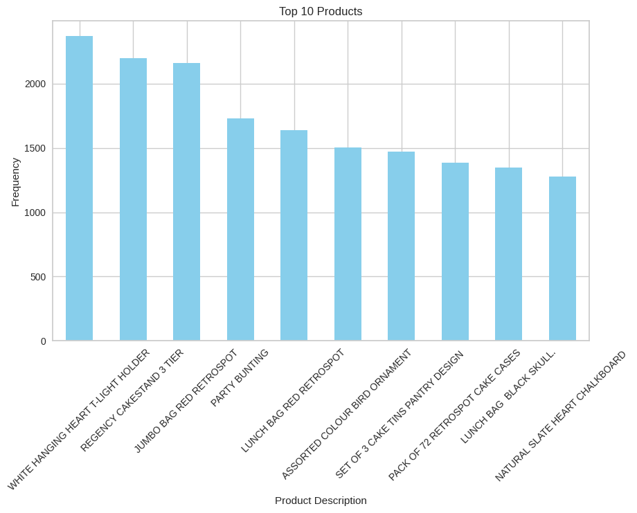
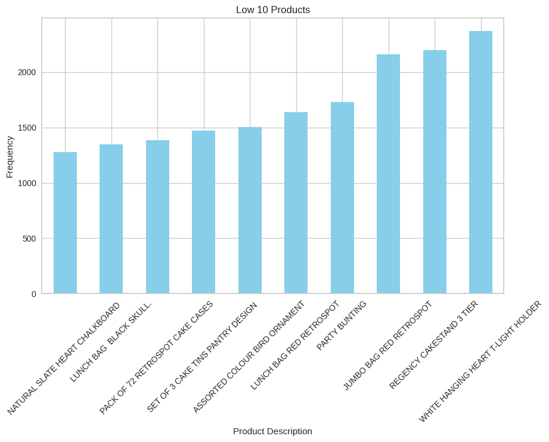
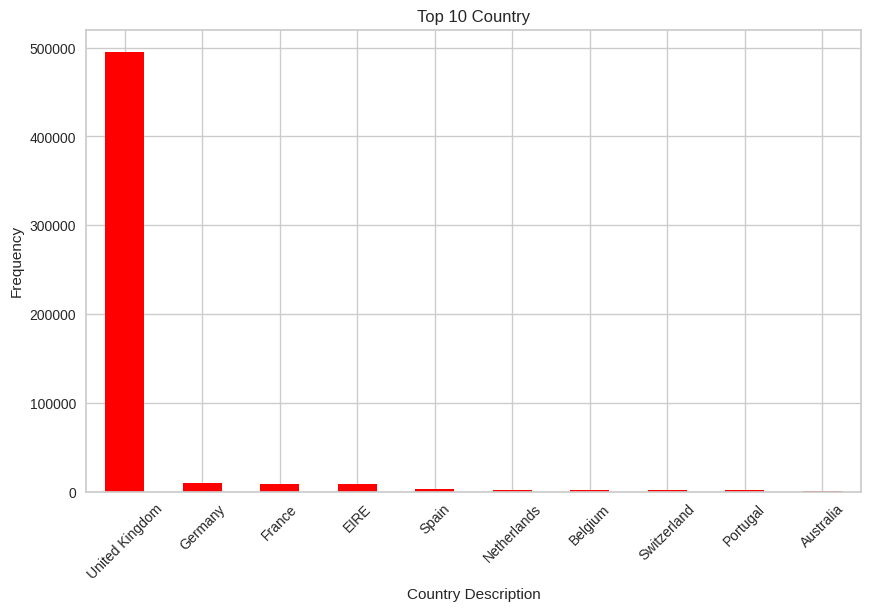
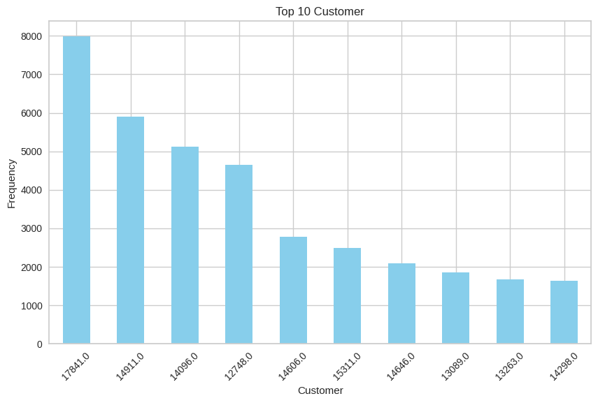
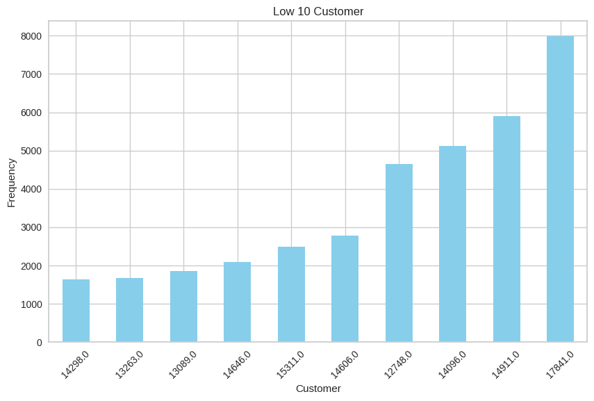
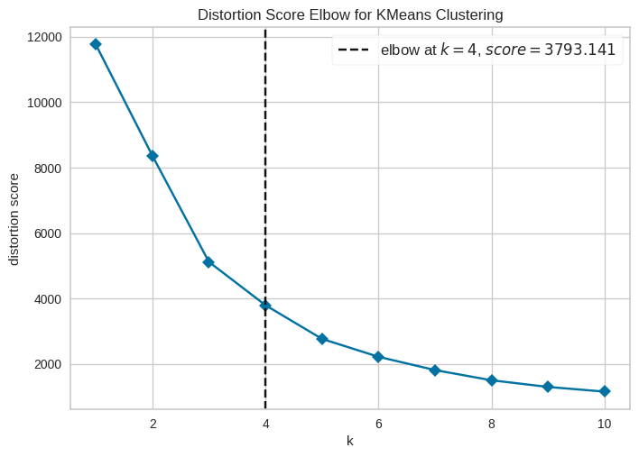
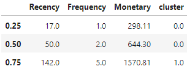
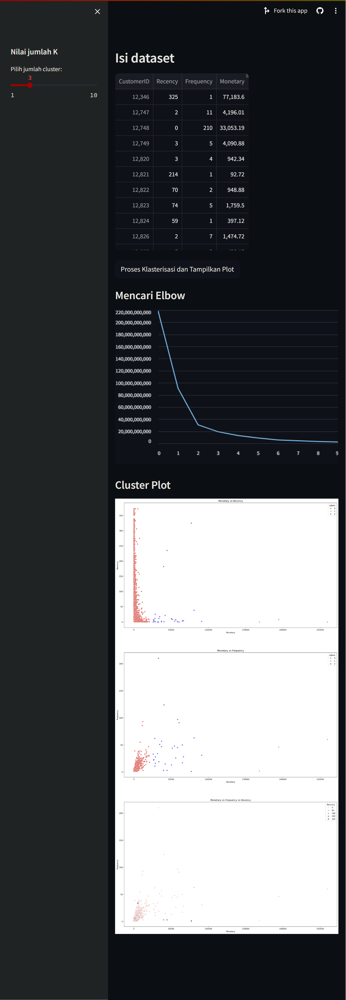

# Laporan Proyek Machine Learning

### Nama : Anggun Lisnawati

### Nim : 211351019

### Kelas : Malam B

## Domain Proyek

Analisis segementasi pelanggan adalah salah satu teknik yang baik untuk di pakai dan dilakukan guna mengatur strategi penjualan kedepannya. dengan adanya analisis segmentasi pelanggan, penjual atau pebisnis dapat mebuat beberapa promo dan strategi bisnis lainnya untuk meningkatkan penjualan berdasarkan kebiasaan pelanggan yang sudah di kelompokan.

## Business Understanding

Berdasarkan domain proyek yang sudah dijelaskan sebelumnya, maka perlu dibuat sistem yang mampu menganalisis dan memberikan informasi terkait pengelompokan pelanggan yang selanjutnya akan membantu pebisnis dalam melakukan treatment kepada pelanggan itu sendiri. Proyek ini dibuat menggunakan metode clustering dengan model RFM dan algoritma K-Means.

### Problem Statements

Menjelaskan pernyataan masalah latar belakang:

- Diperlukannya segmentasi pelanggan untuk menentukan strategi bisnis.
- Pengelompokan kebiasaan antar pelanggan.

### Goals

Menjelaskan tujuan dari pernyataan masalah:

- Segmentasi pelanggan digunakan untuk mengetahui kelompok pelanggan berdasarkan kebiasaan belanjanya.
- Pembagian kelompok tersebut bermaksud untuk meningkatkan strategi bisnis yang memperngaruhi pendapatan.

  ### Solution statements

  - Pembuatan sistem yang mampu melakukan pengelompokan pelanggan menggunakan metode clustering dengan model RFM dan algoritma K-Means.
  - Metrik evaluasi yang di pakai adalah metode Elbow.

## Data Understanding

Dataset Ini adalah kumpulan data transaksional yang berisi semua transaksi yang terjadi antara 01/12/2010 dan 09/12/2011 untuk retail online non-toko yang berbasis di Inggris dan terdaftar. Banyak pelanggan perusahaan ini adalah pedagang grosir. dataset ini berukuran 541909 baris dan 8 kolom.

dataset: [E-Commerce Data](https://www.kaggle.com/datasets/carrie1/ecommerce-data).

### Variabel-variabel pada Dataset ini adalah sebagai berikut:

- InvoiceNo : Nomor pembelian. (object)
- StockCode : kode dari stock barang. (object)
- Description : nama barang. (object)
- Quantity : jumlah barang yang dibeli. (int64)
- InvoiceDate : tanggal transaksi pembelian barang. (object)
- UnitPrice : harga barang. (float)
- CustomerID : ID pelanggan. (float)
- Country : negara tempat transaksi. (object)

tipe data:


## Data Preparation

Dataset "[E-Commerce Data](https://www.kaggle.com/datasets/carrie1/ecommerce-data)" didapat dari website [kaggle](https://www.kaggle.com/).

disini saya akan mengkoneksikan google colab ke kaggle menggunakan token dari akun saya :

```bash
from google.colab import files
files.upload()
```

disni saya akan membuat direktori untuk menyimpan file kaggle.json

```bash
!mkdir -p ~/.kaggle
!cp kaggle.json ~/.kaggle/
!chmod 600 ~/.kaggle/kaggle.json
!ls ~/.kaggle
```

saya akan mendownload file datasetnya dari kaggle :

```bash
!kaggle datasets download -d carrie1/ecommerce-data
```

disini saya mengekstrak file dari dataset yang sudah saya download :

```bash
!mkdir ecommerce-data
!unzip ecommerce-data.zip -d ecommerce-data
!ls ecommerce-data
```

import beberapa library yang akan dipakai :

```bash
import numpy as np
import pandas as pd

import matplotlib.pyplot as plt
import seaborn as sns

import datetime as dt

from sklearn.cluster import KMeans
from yellowbrick.cluster import KElbowVisualizer
from sklearn.preprocessing import StandardScaler

import warnings
warnings.filterwarnings('ignore')
```

Simpan dataset di variabel df :

```bash
df = pd.read_csv('/content/ecommerce-data/data.csv',encoding="ISO-8859-1")
```

Tampilkan 5 baris pertama dari dataset.

```bash
df.head()
```

Tampilkan semua informasi feature.

```bash
df.info()
```

Tampilkan jumlah isi data dan featurenya.

```bash
df.shape
```

Cek jumlah baris data null yang ada pada dataset.

```bash
df.isnull().sum()
```

Tampilkan distribusi negara (country) dalam dataset dan mengetahui berapa jumlah setiap negara dalam dataset.

```bash
df['Country'].value_counts()
```

Tampilkan distribusi produk berdasarkan deskripsi dalam dataset dan mengetahui berapa jumlah setiap produk dalam dataset.

```bash
df['Description'].value_counts()
```

Tampilkan jumlah data yang sama.

```bash
df.duplicated().sum()
```

Menampilkan bar plot untuk 10 produk teratas

```bash
top_10_products = df['Description'].value_counts().head(10)
print(top_10_products)

plt.figure(figsize=(10, 6))
top_10_products.plot(kind='bar', color='skyblue')
plt.title('Top 10 Products')
plt.xlabel('Product Description')
plt.ylabel('Frequency')
plt.xticks(rotation=45)
plt.show()

# Output :
# WHITE HANGING HEART T-LIGHT HOLDER    2369
# REGENCY CAKESTAND 3 TIER              2200
# JUMBO BAG RED RETROSPOT               2159
# PARTY BUNTING                         1727
# LUNCH BAG RED RETROSPOT               1638
# ASSORTED COLOUR BIRD ORNAMENT         1501
# SET OF 3 CAKE TINS PANTRY DESIGN      1473
# PACK OF 72 RETROSPOT CAKE CASES       1385
# LUNCH BAG  BLACK SKULL.               1350
# NATURAL SLATE HEART CHALKBOARD        1280
# Name: Description, dtype: int64
```



Memvisualisasikan 10 produk dengan frekuensi penjualan terendah dalam bentuk diagram batang.

```bash
low_10_products = df['Description'].value_counts().head(10)
low_10_products = low_10_products.nsmallest(10)

plt.figure(figsize=(10, 6))
low_10_products.plot(kind='bar', color='skyblue')
plt.title('Low 10 Products')
plt.xlabel('Product Description')
plt.ylabel('Frequency')
plt.xticks(rotation=45)
plt.show()
```



Menampilkan 10 negara dengan frekuensi kemunculan tertinggi dlam bentuk barplot.

```bash
top_10_country = df['Country'].value_counts().head(10)
print(top_10_country)

plt.figure(figsize=(10, 6))
top_10_country.plot(kind='bar', color='red')
plt.title('Top 10 Country')
plt.xlabel('Country Description')
plt.ylabel('Frequency')
plt.xticks(rotation=45)
plt.show()

# Output :
# United Kingdom    495478
# Germany             9495
# France              8557
# EIRE                8196
# Spain               2533
# Netherlands         2371
# Belgium             2069
# Switzerland         2002
# Portugal            1519
# Australia           1259
# Name: Country, dtype: int64
```



Tampilkan 10 pelanggan dengan frekuensi kemunculan tertinggi dalam bentuk barplot.

```bash
top_10_cust = df['CustomerID'].value_counts().head(10)
print(top_10_cust)

plt.figure(figsize=(10, 6))
top_10_cust.plot(kind='bar', color='skyblue')
plt.title('Top 10 Customer')
plt.xlabel('Customer')
plt.ylabel('Frequency')
plt.xticks(rotation=45)
plt.show()

# Output :
# 17841.0    7983
# 14911.0    5903
# 14096.0    5128
# 12748.0    4642
# 14606.0    2782
# 15311.0    2491
# 14646.0    2085
# 13089.0    1857
# 13263.0    1677
# 14298.0    1640
# Name: CustomerID, dtype: int64
```



Melihat 10 pelanggan dengan frekuensi kemunculan terendah dalam dataset, dalam bentuk barplot.

```bash
low_10_cust = df['CustomerID'].value_counts().head(10)
# Selecting the bottom 10 products (least sold)
low_10_cust = low_10_cust.nsmallest(10)

# Menampilkan diagram batang untuk 10 produk teratas
plt.figure(figsize=(10, 6))
low_10_cust.plot(kind='bar', color='skyblue')
plt.title('Low 10 Customer')
plt.xlabel('Customer')
plt.ylabel('Frequency')
plt.xticks(rotation=45)
plt.show()
```



Hapus data/baris duplikat dalam DataFrame df menggunakan metode drop_duplicates.

```bash
df.drop_duplicates(inplace=True)
```

Buat kolom baru yang hanya berisi data pelanggan yang berasal dari negara "United Kingdom".

```bash
df_uk = df[df['Country'] == 'United Kingdom']
```

filter kolom df_uk yang memiliki nilai Quantity lebih besar dari 0.

```bash
df = df_uk[(df_uk['Quantity']>0)]
```

Ubah kolom 'InvoiceDate' dalam DataFrame df menjadi objek datetime.

```bash
NOW = dt.datetime(2011,12,10)
df['InvoiceDate'] = pd.to_datetime(df['InvoiceDate'])
```

Buat kolom baru 'TotalPrice', yang berisi hasil perkalian antara kolom 'UnitPrice' dan 'Quantity'

```bash
df['TotalPrice'] = df['UnitPrice'] * df['Quantity']
```

Buat Kolom baru recency_df, dengan mengelompokkan data berdasarkan 'CustomerID' dan mengambil tanggal maksimum dari kolom 'InvoiceDate' untuk setiap pelanggan.

```bash
recency_df = df.groupby(['CustomerID'],as_index=False)['InvoiceDate'].max()
recency_df.columns = ['CustomerID','LastPurchaseDate']
```

Tambahkan kolom 'Recency' ke recency_df. Kolom ini berisi informasi mengenai seberapa baru (dalam jumlah hari) pelanggan melakukan pembelian terakhirnya

```bash
recency_df['Recency'] = recency_df.LastPurchaseDate.apply(lambda x : (NOW - x).days)
```

Hapus kolom 'LastPurchaseDate' dari DataFrame recency_df.

```bash
recency_df.drop(columns=['LastPurchaseDate'],inplace=True)
```

Buat kolom baru baru frequency_df dengan menghitung frekuensi pembelian (Frequency) untuk setiap pelanggan berdasarkan jumlah faktur (InvoiceNo).

```bash
frequency_df = df.copy()
frequency_df.drop_duplicates(subset=['CustomerID','InvoiceNo'], keep="first", inplace=True)
frequency_df = frequency_df.groupby('CustomerID',as_index=False)['InvoiceNo'].count()
frequency_df.columns = ['CustomerID','Frequency']
```

Buat kolom baru monetary_df dengan menghitung total nilai transaksi (Monetary) untuk setiap pelanggan berdasarkan kolom 'TotalPrice'.

```bash
monetary_df=df.groupby('CustomerID',as_index=False)['TotalPrice'].sum()
monetary_df.columns = ['CustomerID','Monetary']
```

Menggabungkan kolom recency_df, frequency_df, dan monetary_df menjadi satu kolom yang disebut rfm, berdasarkan kolom 'CustomerID'. Selanjutnya, indeks kolom diatur menjadi 'CustomerID'.

```bash
rf = recency_df.merge(frequency_df,left_on='CustomerID',right_on='CustomerID')
rfm = rf.merge(monetary_df,left_on='CustomerID',right_on='CustomerID')
rfm.set_index('CustomerID',inplace=True)
```

Membuat copy dari kolom rfm.

```bash
rfm1 = rfm.copy()
```

## Modeling

lakukan penskalaan standar pada DataFrame.

```bash
std_scaler = StandardScaler()
rfm_scaled = std_scaler.fit_transform(rfm1)
```

Kode ini digunakan untuk melakukan proses clustering menggunakan algoritma K-Means.

```bash
kmeans = KMeans(n_clusters=4, n_init = 15, random_state=1)
kmeans.fit(rfm_scaled)
```

DataFrame rfm akan memiliki kolom 'cluster', yang menunjukkan keanggotaan kluster untuk setiap pelanggan berdasarkan hasil clustering yang telah dilakukan menggunakan K-Means.

```bash
rfm['cluster'] = kmeans.labels_
```

## Evaluation

Metode siku (elbow method) adalah salah satu metode yang digunakan untuk menentukan jumlah kluster optimal dalam algoritma K-Means. Tujuan utamanya adalah untuk menemukan titik di mana penurunan inersia (Within-Cluster Sum of Squares, WCSS) mulai melambat secara signifikan, membentuk suatu "siku" pada grafik. Pada titik ini, penambahan kluster tidak memberikan penurunan inersia yang signifikan, dan itulah jumlah kluster yang optimal.

```bash
model = KMeans()
visualizer = KElbowVisualizer(model, k=(1,11), timings= False)
visualizer.fit(rfm_scaled)
```



Metrik evaluasi yang digunakan dalam Analysis ini melibatkan pembagian nilai Recency, Frequency, dan Monetary menjadi kuartil (quartiles) untuk membentuk skor-skor. Skor-skor ini kemudian digunakan untuk menggolongkan pelanggan ke dalam segmen-segmen tertentu.

```bash
def RScore(x,p,d):
    if x <= d[p][0.25]:
        return 1
    elif x <= d[p][0.50]:
        return 2
    elif x <= d[p][0.75]:
        return 3
    else:
        return 4

def FMScore(x,p,d):
    if x <= d[p][0.25]:
        return 4
    elif x <= d[p][0.50]:
        return 3
    elif x <= d[p][0.75]:
        return 2
    else:
        return 1
```

```bash
quantile = rfm.quantile(q=[0.25,0.5,0.75])
quantile
```



## Deployment

Berikut link menuju app [https://uas-ml1-anggun.streamlit.app/](https://uas-ml1-anggun.streamlit.app/)

